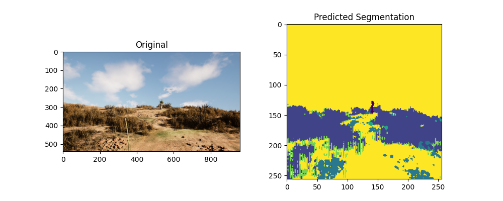

# Autonomous Offroad Perception Module (v1)
---

## 📷 Demo



---

Core perception pipeline for autonomous drone navigation in unstructured off-road environments.

---

## 🧠 Overview

This repository contains the first baseline implementation of a terrain semantic segmentation model for autonomous aerial systems.

The goal is to enable drones to understand:
- Drivable terrain
- Obstacles
- Vegetation
- Unstructured environments

---

## 📊 Baseline Performance

- Model: Custom segmentation pipeline
- Dataset: Synthetic off-road dataset
- IoU Score: **0.29**
- Status: Baseline prototype

---

## 🏗 System Architecture

Training → Evaluation → Visualization pipeline

- `train_segmentation.py` — Model training
- `test_segmentation.py` — Evaluation
- `visualize.py` — Prediction rendering
- `ENV_SETUP/` — Environment setup scripts

---

## 🚀 Roadmap

### v2
- Data augmentation
- Dice / Focal loss
- Learning rate scheduling
- IoU target: 0.40+

### v3
- UNet / DeepLabV3
- Real-world dataset adaptation
- Domain generalization

---

## 🎯 Vision

This project is part of a larger initiative toward building fully autonomous drone systems capable of operating in GPS-denied and off-road environments.

---

## 📌 Status

Active research & development.
---

## ⚙️ Installation

## ⚙ Installation

## ⚙️ Installation
## ⚙️ Installation

```bash
git clone https://github.com/shubh-tiwari9614/Offroad-Semantic-Segmentation.git
cd Offroad-Semantic-Segmentation
pip install -r requirements.txt
```


Current IoU: 0.29  
Target IoU: 0.40+
Baseline qualitative results will be published after performance optimization (v2).

This repository is under active research & development.
